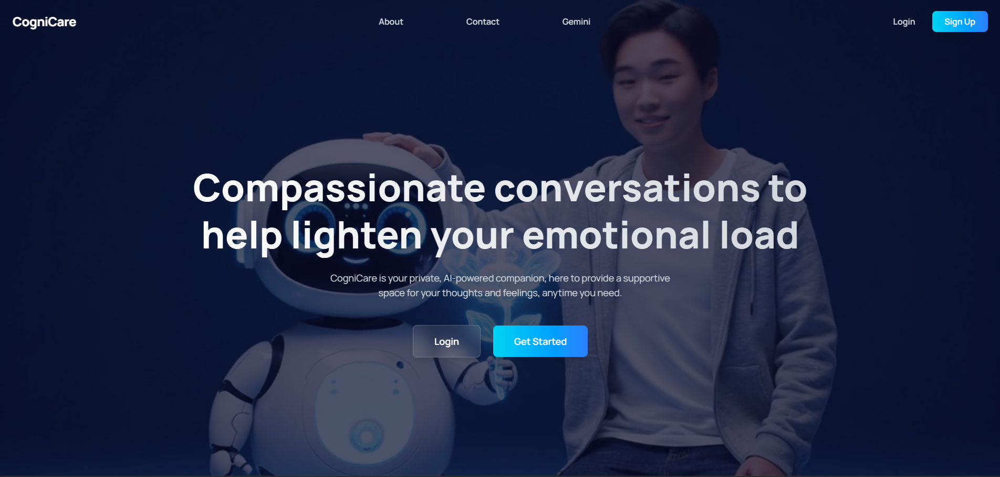

# CogniCare.ai - A Supportive Mental Health Chatbot

A RAG-powered, empathetic AI chatbot providing supportive conversations and information grounded in authoritative mental health resources.


---

### ▶️ [Live Demo](https://cogni-care-your-supportive-chatbot.vercel.app)

---

## 📖 About The Project

CogniCare.ai addresses the critical need for safe and reliable AI-driven mental health support. Unlike general-purpose chatbots that can hallucinate or provide unverified advice, CogniCare.ai is built on a **Retrieval-Augmented Generation (RAG)** pipeline.

This means every answer the AI provides is grounded in a curated, private knowledge base of authoritative sources (like the World Health Organization, National Institute of Mental Health, etc.). This ensures users receive information that is safe, empathetic, and factually based, providing a responsible space for psychoeducation and supportive conversation.



---

## 🌟 Key Features

-   **RAG-Powered Responses**: The core feature. All conversations are augmented with relevant context retrieved from a dedicated Pinecone vector database, preventing hallucinations and ensuring safety.
-   **Curated Knowledge Base**: The AI's knowledge is strictly limited to information scraped from pre-approved, authoritative mental health websites (e.g., NIMH, WHO).
-   **Empathetic AI Persona**: Uses Google's Gemini-1.5-Flash model, guided by a strict system prompt to maintain an empathetic, supportive, and non-judgmental tone.
-   **Critical Safety System**: Includes a hard-coded safety prompt to immediately recognize crisis language (e.g., self-harm, suicide) and respond by providing crisis hotlines, not AI advice.
-   **Conversation History**: The RAG chain incorporates past messages to provide context-aware follow-up responses.
-   **Modern & Responsive UI**: A clean, simple, and accessible chat interface built with Next.js and Tailwind CSS.

---

## 🔧 Tech Stack

This project uses a modern, serverless-first stack designed for building scalable and efficient RAG applications.

| Technology | Role & Justification |
| :--- | :--- |
| **Next.js (TS)**| **Full-Stack Framework**: Used for both the responsive frontend UI and the serverless backend API route (`/api/chat`) that runs the RAG chain. |
| **LangChain.js**| **RAG Orchestrator**: The "glue" for the AI. It manages the entire process: creating embeddings, retrieving documents from Pinecone, formatting the prompt, and calling the LLM. |
| **Google Gemini**| **AI & Embeddings**: Uses `gemini-1.5-flash` for fast and high-quality chat generation and `text-embedding-004` for state-of-the-art text embeddings. |
| **Pinecone** | **Vector Database**: Provides a high-performance, serverless vector store for persisting and querying the embedded mental health documents. |
| **Tailwind CSS**| **CSS Framework**: For rapid, utility-first styling to build the clean and responsive chat interface. |
| **Cheerio** | **Web Scraper**: Used in the one-time ingestion script (`scripts/setup.ts`) to load website content from the specified URL list. |
| **Vercel** | **Cloud Hosting**: Provides seamless, Git-based deployment and hosting for the entire Next.js application. |

---

## 📦 Getting Started

This project has two key parts: the **one-time data ingestion** and the **main application**.

### Prerequisites

-   **Node.js** (`v18` or higher) & **npm**
-   A **Google Gemini API Key** (from [Google AI Studio](https://aistudio.google.com/))
-   A **Pinecone API Key** and a free index (from [Pinecone](https://www.pinecone.io/))
    -   Your index must be configured to match the dimensions of the embedding model (e.g., `768` for `text-embedding-004`).

### Installation & Setup

1.  **Clone the repository:**
    ```bash
    git clone [https://github.com/your-username/cognicare-ai.git](https://github.com/your-username/cognicare-ai.git)
    cd cognicare-ai
    ```
2.  **Install dependencies:**
    ```bash
    npm install
    ```
3.  **Setup Environment Variables:**
    Create a `.env.local` file in the root of the project and add your API keys:
    ```env
    GEMINI_API_KEY="your_google_api_key"
    PINECONE_API_KEY="your_pinecone_api_key"
    ```
    *(Note: You'll also need to configure your Pinecone index name inside the scripts/API files).*

---

### ▶️ Running the App

#### Step 1: Ingest Data (Run this ONCE)

Before you can run the app, you *must* populate your Pinecone database. We do this using the `scripts/setup.ts` file.

1.  **Customize your sources**: Open `scripts/setup.ts` and add/remove URLs from the `MENTAL_HEALTH_URLS` list.
2.  **Run the script**:
    ```bash
    npm install -g ts-node # If you don't have it globally
    npx ts-node scripts/setup.ts
    ```
This script will scrape all the websites, split them into chunks, create embeddings, and upload them to your Pinecone index. This may take a few minutes. You only need to do this once, or when you want to update your knowledge base.

#### Step 2: Run the Main Application

Once ingestion is complete, you can start the web server.

```bash
npm run dev

📜 License

Distributed under the MIT License.
