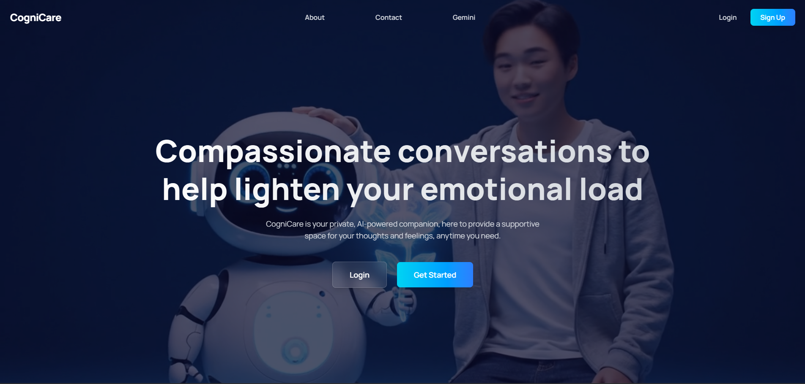

# 🏥 CogniCare - AI-Powered Healthcare Chatbot

CogniCare is a **healthcare chatbot platform** built with **Next.js**, **Tailwind CSS**, and integrated with the **Gemini AI API**. It provides intelligent healthcare responses, secure user authentication, and seamless email notifications via EmailJS.


---

### ▶️ [Live Demo](https://your-cognicare-website.vercel.app)

---

## 📖 About The Project

CogniCare is a **Gemini AI-powered healthcare chatbot** that assists users with medical inquiries, appointment guidance, and healthcare advice. It includes **secure login and registration**, persistent user data storage, and a responsive, modern interface.



---

## 🌟 Key Features

- **AI-Powered Chatbot**: Provides healthcare guidance using Gemini API.  
- **Secure Authentication**: Uses JWT and bcrypt for password hashing and session management.  
- **Email Notifications**: Users receive emails via EmailJS for registration and appointment confirmations.  
- **Responsive Design**: Built with Tailwind CSS for mobile-first, modern UI.  
- **Next.js Optimizations**: Server-side rendering and fast performance.

---

## 🔧 Tech Stack

| Technology      | Role & Justification                                                                 |
| :-------------- | :--------------------------------------------------------------------------------- |
| **Next.js**     | React framework with SSR and optimized performance.                                 |
| **Tailwind CSS**| Rapid and responsive UI styling with utility-first classes.                         |
| **Gemini API**  | AI backend providing healthcare responses to user queries.                         |
| **JWT**         | Secure user authentication and session management.                                  |
| **bcrypt**      | Password hashing for secure storage of user credentials.                            |
| **EmailJS**     | Sends emails directly from frontend without requiring a backend mail server.       |
| **JavaScript/TypeScript** | Core frontend and backend programming language.                            |
| **Vercel**      | Hosting platform for live deployment.                                              |

---

## 📦 Getting Started

Follow these steps to run the project locally.

### Prerequisites

- Node.js (`v14` or higher)  
- npm (`v6` or higher)

### Installation & Setup

1. **Clone the repository**

```bash
git clone https://github.com/vikasgautam2003/cognicare.git
cd cognicare


📁 Project Structure
.
├── public/             # Static assets (images, icons)
├── components/         # Reusable React components
├── pages/              # Next.js page routes
├── lib/                # Utility functions, API calls, JWT handling
├── styles/             # Tailwind CSS & custom styles
├── .env                # Environment variables (not committed)
├── package.json
└── README.md


🎯 Future Roadmap

 Integrate appointment scheduling system.

 Add multilingual support for the chatbot.

 Include AI analytics dashboard for user queries.

 Improve accessibility and SEO for better reach.


📧 Contact

Email: vikasgautamug2003@gmail.com

GitHub: [vikasgautam2003](https://github.com/vikasgautam2003)

LinkedIn: https://www.linkedin.com/in/vikas-gautam-ab5ab8278/
